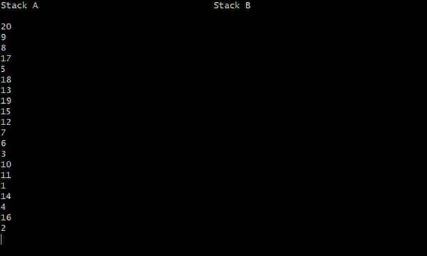
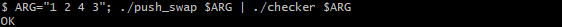
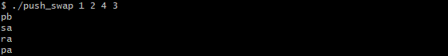
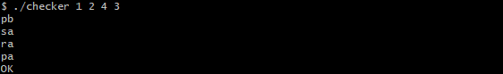
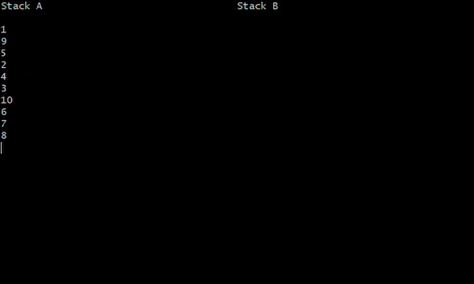

# Push_swap
In this project for @hivehelsinki, my task was to sort numbers using two stacks and as few instructions as possible.



## Programs
The project consists of two programs: *push_swap* and *checker*.



### *Push_swap*
*Push_swap* takes a list of integers as an argument and prints a set of instructions that sort the values to the standard output.



### *Checker*
*Checker* takes a list of integers as an argument and reads a set of instructions from the standard output. It executes the instructions. If the values are in order, it prints "OK" to the standard output. Otherwise, it prints "KO" to the standard output.



## Stacks
The programs sort the integers using two stacks: A and B.

### Stack A
In the beginning, stack A contains the values. In the end, the numbers are in ascending order in the stack.

### Stack B
At the beginning and the end, stack B is empty.

## Instructions
The programs sort the integers using instructions. The 11 instructions are sa, sb, ss, pa, pb, ra, rb, rr, rra, rrb, and rrr.

### Sa
Swap A swaps the places of the two elements at the top of stack A.

### Sb
Swap B swaps the places of the two elements at the top of stack B.

### Ss
Ss executes both sa and sb.

### Pa
Push A pushes the element at the top of stack B to the top of stack A.

### Pb
Push B pushes the element at the top of stack A to the top of stack B.

### Ra
Rotate A rotates the element at the top of stack A to the bottom of stack A.

### Rb
Rotate B rotates the element at the top of stack B to the bottom of stack B.

### Rr
Rr executes both ra and rb.

### Rra
Reverse Rotate A rotates the element at the bottom of stack A to the top of stack A.

### Rrb
Reverse Rotate B rotates the element at the bottom of stack B to the top of stack B.

### Rrr
Rrr executes both rra and rrb.

## Sorting Algorithms
I used two sorting algorithms to sort the integers: one for a small and the other for a big list of values.

### Sorting a Small List of Integers
The algorithm finds the biggest element out of the two topmost elements and the bottom-most element and moves it to the bottom. Then, it finds the smallest element out of the same three elements and moves it to the top. Then, it pushes the topmost element to stack B. It repeats these steps until stack A is in order.

Then, the algorithm rotates stack A until the topmost element is bigger, and the bottom-most element is smaller than the topmost element of stack B. Then, it pushes the element to stack A. It repeats these steps until all the elements are in stack A. Then, it rotates the stack until the smallest element is at the top.



### Sorting a Big List of Integers
The algorithm divides the elements into groups based on their size. Then, it pushes a group at a time to stack B.

Then, the algorithm rotates stack A until the topmost element is bigger, and the bottom-most element is smaller than the first element of the last group in stack B. Then, it pushes the element to stack A. It repeats these steps until all the elements of the group are in stack A. Then, it moves to the previous group and repeats the steps above until all the groups are in stack A. Then, it rotates the stack until the smallest element is at the top.


## Installation and Usage
Clone the repository by pasting "`git clone https://github.com/janettem/Push_swap.git Push_swap`" to your terminal. Then, move to the directory: `cd Push_swap`. Then, compile the programs: `make`.

```
usage: ./push_swap n1 [n2 ...]
  n1, n2, etc.: integers
```

```
usage: ./checker n1 [n2 ...] < input_file
  n1, n2, etc.: integers
  input_file: the input file containing newline-separated instructions in lower case
````
